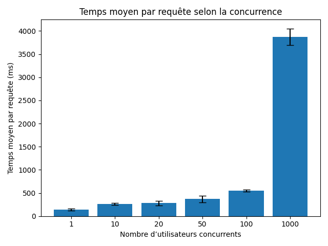
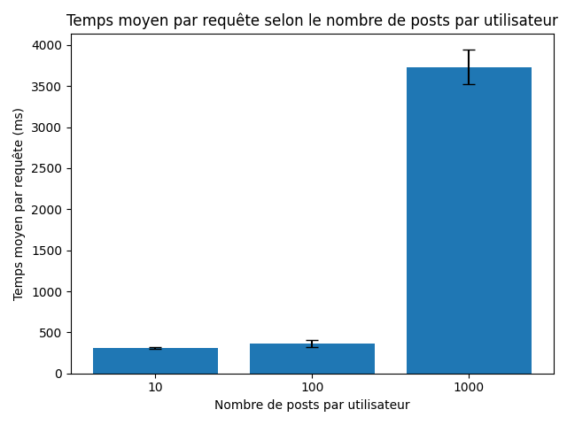
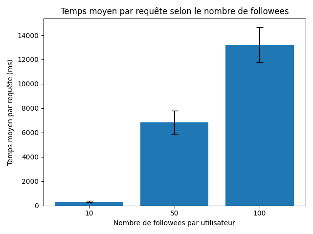

# TinyInsta Benchmark - Projet Données Massives et Cloud

## Description

Ce projet évalue les performances de **TinyInsta**, un réseau social minimaliste déployé sur Google Cloud Platform. L'objectif est de mesurer comment les temps de réponse évoluent en fonction de :

1. Le nombre d'utilisateurs simultanés (concurrence)
2. La taille des données (nombre de posts et de followees)

## Application déployée

🔗 **URL de l'application** : https://cours-cloud-473712.ew.r.appspot.com

## Résultats des benchmarks

### Exercice 1 : Passage à l'échelle sur la charge (Concurrence)

**Configuration** : 1000 utilisateurs, 50 posts/utilisateur, 20 followees/utilisateur

Test des niveaux de concurrence : 1, 10, 20, 50, 100, 1000 utilisateurs simultanés.



### Exercice 2 : Passage à l'échelle sur la taille des données

#### Variation du nombre de posts par utilisateur

**Configuration** : 50 utilisateurs simultanés, 20 followees/utilisateur

Test avec 10, 100, 1000 posts par utilisateur.



#### Variation du nombre de followees par utilisateur

**Configuration** : 50 utilisateurs simultanés, 100 posts/utilisateur

Test avec 10, 50, 100 followees par utilisateur.



## Environnement de test

> **Note** : Tous les tests ont été réalisés dans des conditions identiques (même machine, même connexion réseau) afin de garantir la reproductibilité et la comparabilité des résultats. Avant chaque série de mesures, des requêtes de warm-up ont été effectuées pour éviter les effets de cold start.

## Conclusion

En comparant les trois benchmarks, on observe que l'impact de la concurrence et du nombre de posts sur les temps de réponse est négligeable. En revanche, le **nombre de followees (fanout)** est le principal facteur affectant la scalabilité de l'application TinyInsta.

## Structure du projet

```
├── bench_conc.py        # Script benchmark concurrence
├── bench_post.py        # Script benchmark posts/utilisateur
├── bench_fanout.py      # Script benchmark followees/utilisateur
├── make_plots.py        # Génération des graphiques
├── seed_improved.py     # Script de peuplement des données
├── reset_datastore.py   # Script de réinitialisation du Datastore
├── commands.txt         # Commandes utiles
├── out/
│   ├── conc.csv         # Résultats benchmark concurrence
│   ├── conc.png         # Graphique concurrence
│   ├── post.csv         # Résultats benchmark posts
│   ├── post.png         # Graphique posts
│   ├── fanout.csv       # Résultats benchmark fanout
│   └── fanout.png       # Graphique fanout
└── readme.md
```

## Utilisation

### Prérequis

- Python 3.12+
- `aiohttp`, `pandas`, `matplotlib`
- Google Cloud SDK (pour le seeding)

### Exécution des benchmarks

#### Benchmark Concurrence (Exercice 1)

```bash
# Réinitialiser et peupler le Datastore
python reset_datastore.py
python seed_improved.py --users 1000 --posts 50000 --follows-min 20 --follows-max 20

# Lancer le benchmark
python bench_conc.py --base-url https://cours-cloud-473712.ew.r.appspot.com --user-prefix user --max-users 1000
```

#### Benchmark Posts (Exercice 2)

```bash
# Pour 10 posts/utilisateur
python seed_improved.py --users 1000 --posts 10000 --follows-min 20 --follows-max 20
python bench_post.py --base-url https://cours-cloud-473712.ew.r.appspot.com --params 10

# Pour 100 posts/utilisateur
python seed_improved.py --users 1000 --posts 100000 --follows-min 20 --follows-max 20
python bench_post.py --base-url https://cours-cloud-473712.ew.r.appspot.com --params 100

# Pour 1000 posts/utilisateur
python seed_improved.py --users 1000 --posts 1000000 --follows-min 20 --follows-max 20
python bench_post.py --base-url https://cours-cloud-473712.ew.r.appspot.com --params 1000
```

#### Benchmark Fanout (Exercice 2)

```bash
# Pour 10 followees/utilisateur
python seed_improved.py --users 1000 --posts 100000 --follows-min 10 --follows-max 10
python bench_fanout.py --base-url https://cours-cloud-473712.ew.r.appspot.com --params 10

# Pour 50 followees/utilisateur
python seed_improved.py --users 1000 --posts 100000 --follows-min 50 --follows-max 50
python bench_fanout.py --base-url https://cours-cloud-473712.ew.r.appspot.com --params 50

# Pour 100 followees/utilisateur
python seed_improved.py --users 1000 --posts 100000 --follows-min 100 --follows-max 100
python bench_fanout.py --base-url https://cours-cloud-473712.ew.r.appspot.com --params 100
```

### Génération des graphiques

```bash
python make_plots.py
```

## Format des fichiers CSV

Chaque fichier CSV contient les colonnes suivantes :

| Colonne  | Description                                                  |
| -------- | ------------------------------------------------------------ |
| PARAM    | Paramètre testé (concurrence, posts/user, ou followees/user) |
| AVG_TIME | Temps moyen de réponse en millisecondes                      |
| RUN      | Numéro de l'exécution (1, 2 ou 3)                            |
| FAILED   | 1 si au moins une requête a échoué, 0 sinon                  |

## Auteur

Ahmad Fatayerji

## Références

- [TinyInsta (massive-gcp)](https://github.com/momo54/massive-gcp)
- [App déployée](https://cours-cloud-473712.ew.r.appspot.com/)
